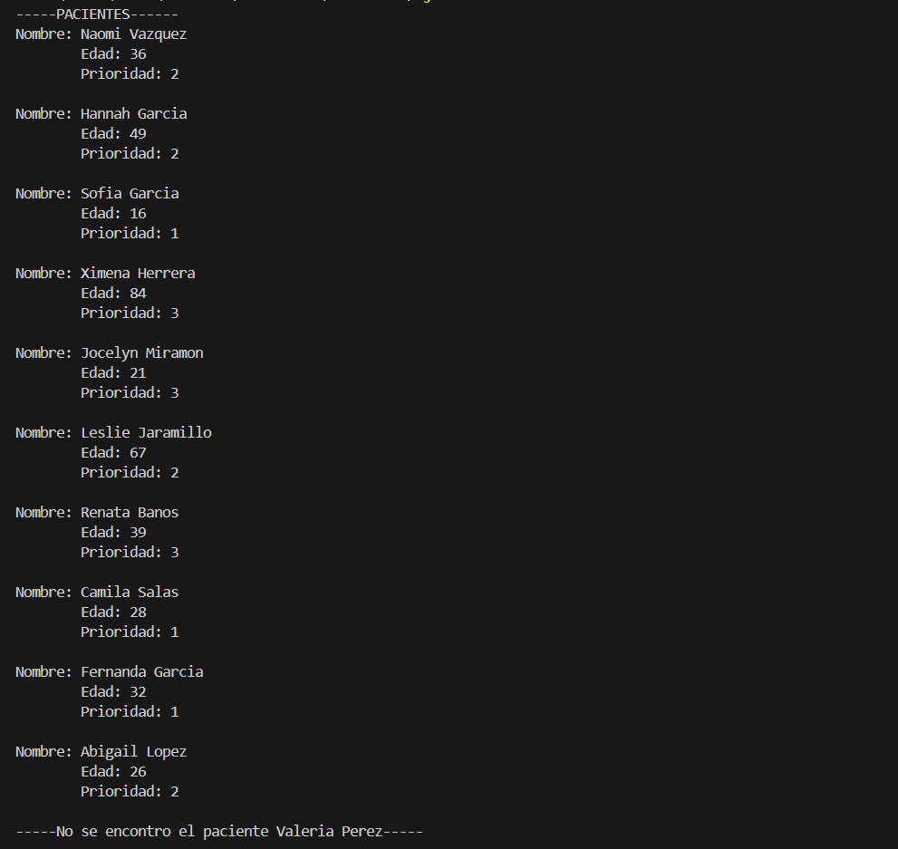

# Tarea3C

## Ejercicio6:Crea un sistema que gestiones un catálogo de libros en una biblioteca.
## Ejercicio 7: Crea un programa donde simule la gestión de pacientes de un hospital

[Ejecución](imagenes/Captura%20desde%202025-04-28%2006-48-46.png)

[Ejecución](imagenes/Captura%20desde%202025-04-28%2006-49-09.png)

[Ejecución](imagenes/ejecucion2.png)

#  Copilación y Ejecución.
## Ejercicio6:
 ## gcc ejercicio6.c -o ejercicio6
## ./ejercicio6

## Ejercicio7:
 ## gcc ejercicio7.c -o ejercicio7
## ./ejercicio7

